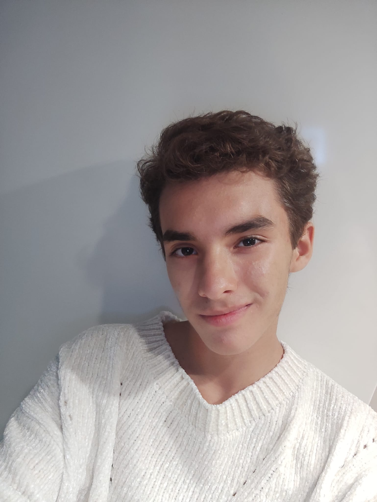

## Bio

  

    ESP/ENG
    Un joven apasionado por la programación y el software, que dedica sus estudios y parte de su tiempo libre a ello. Mi sueño es ser un game designer
    A young man who loves programation and software, which spends his career and some free time to that. My dream is to be a game designer.
  

  

## Estudios y Conocimientos obtenidos | Studies and Knowledge obtained

**Team vscode**
 

### Desarrollo de Aplicaciones Web | Development of Web Services

  
  
  
  

  
  
  

## Proyectos | Projects

  

## Contacto | contact

  
  
  
   

